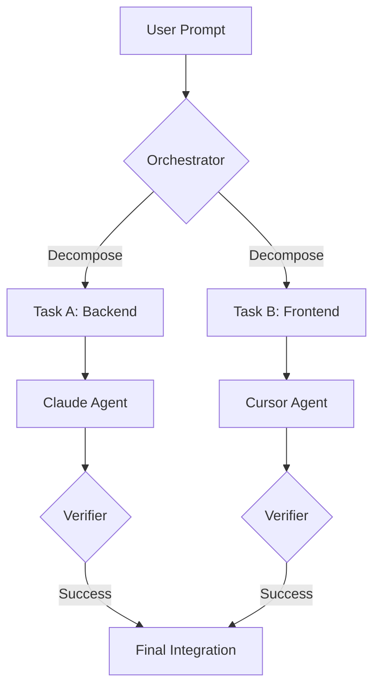

# SOP: Orchestrating Parallel Workflows

## Purpose

Provides a framework for managing high-complexity tasks by delegating them to multiple specialized coding agents (Claude Code, Cursor, Codex, Copilot, Pi, fx, Antigravity, DeepSeek Harness, and others) in parallel. It ensures resource efficiency by checking budgets, respects user preferences for agent priority, and maintains workflow reliability through active monitoring and self-healing.

## Workflow Checklist

### 1. Pre-Flight: Resource & Priority Check

- [ ] **Verify Budget (Mandatory)**: The Orchestrator MUST check the budget of _every_ agent it intends to use before starting.
  - For Claude: Run `ccusage daily --json` (if available) or check Anthropic Console.
  - For Antigravity (`agy`): Check Google-side quotas and permission settings relevant to the task.
  - For DeepSeek Harness (`dsh`): Confirm credentials for the configured provider (see `deepseek-harness-cli` / cli-reference); plan task size—no universal remaining-quota CLI.
  - For Codex: Check OpenAI/ChatGPT message limits.
  - For Cursor: Check Fast request remaining in settings.
- [ ] **Establish Priority**: Ask the user to rank available agents (e.g., "Cursor > Claude > Codex > dsh").
- [ ] **Persist Rules**: Save the priority preference to `AGENT.md` and `CLAUDE.md`.

### 2. Planning: Decomposition

- [ ] **Analyze Requirement**: Identify independent workstreams.
- [ ] **Decompose**: Use the `orchestrating-parallel-tasks` skill to create mutually exclusive sub-tasks.
- [ ] **Define Interfaces**: Establish contracts between sub-tasks to prevent merge conflicts.
- [ ] **Visualize**: Create a Mermaid diagram (e.g., flowchart or sequence diagram) to illustrate the orchestration flow and agent dependencies.

### 3. Execution: Multi-Agent Delegation

- [ ] **Initialize State**: Create `.todo_list/orchestration.json` to track sub-tasks and assigned Agent IDs.
- [ ] **Launch Agents**: Invoke worker sub-agents for each "Ready" task in the dependency graph.
- [ ] **Minimize Direct Edits**: The orchestrator should NOT edit code directly; it only manages delegation.

### 4. Monitoring: Heartbeat & Self-Healing

- [ ] **Track Progress**: Periodically poll worker agents for status updates.
- [ ] **Detect Issues**: Identify agents that are hung, failed, or hitting rate limits.
- [ ] **Recover**: Resume or restart agents using their Agent IDs if they show abnormal behavior.
- [ ] **Verify Results**: Use a verification step (e.g., `verifier` agent) for each sub-task completion.

## Detailed Instructions

### 1. Budget & Priority Workflow

Before launching any worker agents, the orchestrator must perform these steps:

1.  **Check Tools**: Try running `ccusage daily --json` for Claude; for Harness workers follow `deepseek-harness-cli` pre-flight; use each CLI's documented status or console tools where available.
2.  **User Inquiry**: If tools fail or are missing, use the `AskQuestion` tool:
    > "I'm initializing the orchestration workflow. To optimize agent selection, please provide:
    >
    > 1. Your preferred priority order for coding agents (e.g., Cursor > Claude > Codex > dsh).
    > 2. Any known budget or rate limit constraints for these tools."
3.  **Persistence**: Write the priority order to `AGENT.md` and `CLAUDE.md` in the following format:

    ```markdown
    ## Agent Priority Configuration

    - **Primary**: [Agent Name]
    - **Secondary**: [Agent Name]
    - **Tertiary**: [Agent Name]
    - **Fallback**: [Agent Name]
    ```

### 2. Visualization (Mermaid Diagram)

Every plan generated by this skill must include a visual diagram using Mermaid syntax. This helps humans verify the orchestration logic at a glance.

**Example Mermaid Flowchart:**



**Instruction:** Choose between a flowchart (for task decomposition) or a sequence diagram (for complex inter-agent communication) based on which better illustrates the current requirement.

### 3. State Management (.todo_list/orchestration.json)

Use this JSON file to track the lifecycle of all sub-agents. The orchestrator must update this file after every significant action (launch, heartbeat, completion).

```json
{
  "orchestration_id": "orch_20260209_123456",
  "status": "active",
  "priority": ["cursor", "claude", "codex", "dsh"],
  "tasks": [
    {
      "task_id": "refactor-auth",
      "status": "in_progress",
      "agent_type": "deepseek-harness-cli",
      "agent_id": "agent_abc123",
      "resource_cost_estimate": "Medium",
      "start_time": "2026-02-09T10:00:00Z",
      "last_heartbeat": "2026-02-09T10:05:00Z",
      "retries": 0
    }
  ]
}
```

### 4. Monitoring & Self-Healing Protocol

The orchestrator maintains a "Heartbeat Loop" to ensure progress:

1.  **Status Check**: For every `in_progress` task, check the latest output of the agent using its `agent_id`.
2.  **Detection**:
    - **Hung Agent**: No output change for > 5 minutes.
    - **Failed Agent**: Agent reports an error or exits with non-zero code.
    - **Stalled Agent**: Agent is repeatedly asking for permissions that were already granted or is stuck in a reasoning loop.
3.  **Healing Actions**:
    - **Resume**: If an agent is hung or stalled, attempt to `Resume agent [agent_id]` with a prompt to "Continue from where you left off, focusing on [current step]".
    - **Restart**: If an agent failed catastrophically or hitting immutable rate limits, spawn a new agent of the same type (or the next priority agent) for the same sub-task.
    - **Backoff**: If rate limits are detected, wait for the specified period before retrying.

## Success Criteria

- The high-level task is completed without the orchestrator hit context limits.
- Sub-tasks are executed in parallel where possible.
- Agent failures are detected and addressed without human intervention.
- The user's preferred agent order is respected throughout the session.
- Generated plans include a visual Mermaid diagram of the orchestration workflow.
